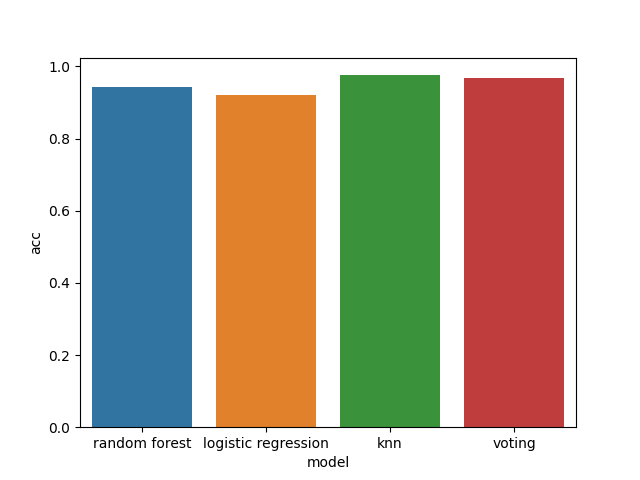

## 環境構築

1. `docker build -t <任意のタグ名> .`でイメージをビルドする(ex. `docker build -t dog-vs-cat-vs-rabbit .`)

## 実行方法

1. `docker run -v <本ディレクトリへのパス>:/work -it --rm <任意のタグ名> python main.py --apply_pca`を実行する(`--apply_pca`はなくてもよいが、実行にかなり時間がかかるので推奨)。

   **各モデルでチューニングを実施してから再度学習を実施するため、 30 ~ 60 分程度かかる。**

2. 完了した場合は`./dst`に「以下のような画像」と「分類機ごとの性能が記載された csv」 が出力されるので確認する。

   

## 使用モデル

- voting に使用した使用モデル

  - random forest

  - ロジスティクス回帰

  - knn
